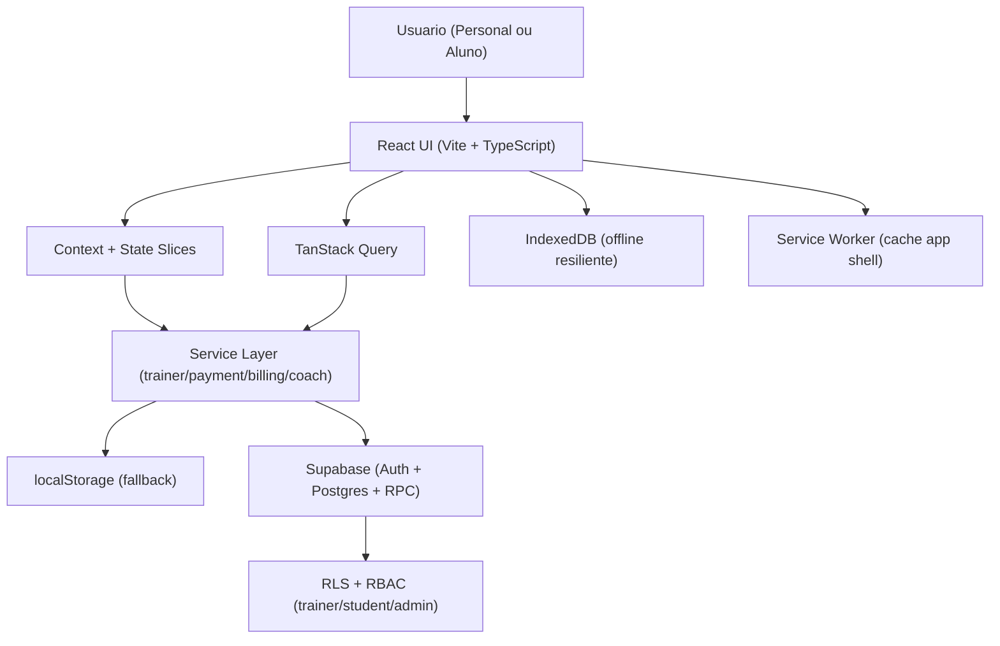

# Arquitetura - Insane Fit

## Visao geral

O app segue arquitetura frontend-first com fallback local e sincronizacao opcional em Supabase.

## Camadas

- **UI**: componentes em `src/components/*`
- **Estado**: `src/context/*` (slices, handlers, effects, derived state)
- **Dados**:
  - queries em `src/queries/*`
  - services em `src/services/*`
- **Schemas/validacao**: `src/schemas/supabaseSchemas.ts` (Zod)
- **Mobile/PWA gate**: `npm run pwa:check` + `docs/mobile-pwa-checklist.md`

## Fluxos principais

1. **Autenticacao**
   - Supabase Auth quando credenciais existem
   - Modo local como fallback

2. **Treinos**
   - Personal monta treino no builder (`WorkoutView`)
   - Protocolo serializado em nota (warm-up, feeder, work, cluster, myo)
   - Aluno executa no `StudentPortal` com rastreamento de series

3. **Financeiro**
   - Snapshot por aluno (mensalidade, vencimento, status)
   - Operacoes atomicas via RPC (`upsert_student_payment`)

4. **Offline sync health**
   - Fila de mutacoes em `src/services/offlineSyncQueue.ts`
   - Telemetria local em `src/services/syncTelemetryStore.ts`
   - Dashboard mostra pendencias, conflitos descartados e falhas consecutivas

## Banco e autorizacao

- Script principal: `supabase/schema.sql`
- Isolamento por `auth.uid()`
- Roles: `trainer`, `student`, `admin`
- Matriz completa: `docs/rbac-matrix.md`

## CI/CD

- CI: `.github/workflows/ci.yml` (lint, typecheck, tests, build)
- CD: `.github/workflows/cd-vercel.yml` (preview/prod com Vercel)
